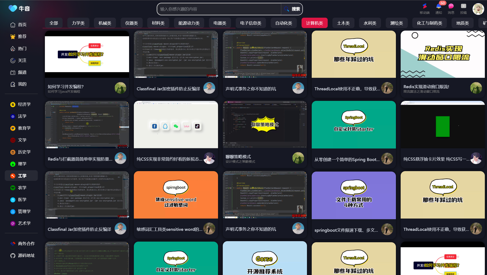
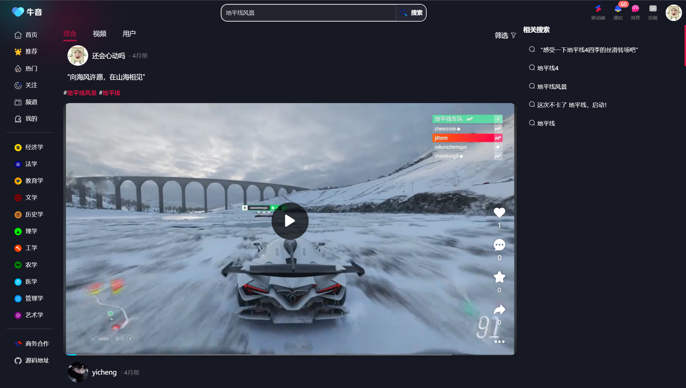

# niuyin-web

芝士短视频开发平台前端

# Vue 3 + TypeScript + Vite

# 使用到的库

npm install swiper

## vue3视频播放器

npm i vue3-video-play --save

## vue图片预览组件

npm install v-viewer@next

## vue智能显示几天前插件

npm install timeago.js

## 高德地图

npm i @vuemap/vue-amap

## vue瀑布流组件

v-masonry

## cookie

npm i js-cookie

# 运行效果

首页

推荐

热门

关注

我的

分类

搜索

全屏

[//]: #
